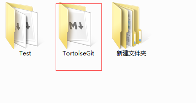

tortoisegit 安装及上传方法
===========================================

1. 打开安装程序，进入安装界面
   
   
   
   
2. 点击"NEXT"
   
   
   
   
3. 点击"NEXT"
   
   
   
   
4. 点击"NEXT"
   
   
   
   
5. 点击"NEXT"
   
   
   
   
6. 安装中请稍后
   
   
   
   
7. 点击"Finish"，完成安装
   
   
   
   
8. 安装成功后，在空白处，单机鼠标右键，出现图中红色标记部分，表示完成安装，并生效
   
   
   
9.上传githup网站，打开网站，找到已建文件夹，打开依照如图所示点击复制
   
   
   
   
10.在空白处（最好是空白文件夹里）右击鼠标点击Git Clone、、、
   
   
   
   
11.点击OK
   
   
   
   
12.读条程序中
   
   
   
   
13.当对话框内提示“Success"是点击Close,进行关闭
   
   
   
   
14.找到已下载的文件夹点击进入
   
   
   
   
15.把已做好的文件或文档放入文件夹内
   
   
   
   
16.空白处点击鼠标右键，按图所示点击Add、、、
   
   
   
   
17.选取所要上传的资料，点击OK.
   
   
   
   
18.当对话框中提示”Success“时，点击”Commit、、、“(不要点击OK).
   
   
   
   
19.安装程序跳转到当前对话框时，输入任意字母，点击”Commit“.
   
   
   
   
20.软件读取，当对话框提示”Success“时，点击”Push、、、“
   
   
   
   
21.点击”OK“
   
   
   
   
22.输入用户名
   
   
   
   
23.输入用户密码
   
   
   
   
24.软件读取，当对话框提示”Success“时，点击”Close“
   
   
   
    
25.进入所传Githup的相关文件夹，点击进入
   
   
   
   
26.点击找到所存文档的位置
   
   
   
   
27.点击打开文档，此文档便是当前所做的操作流程。
   

